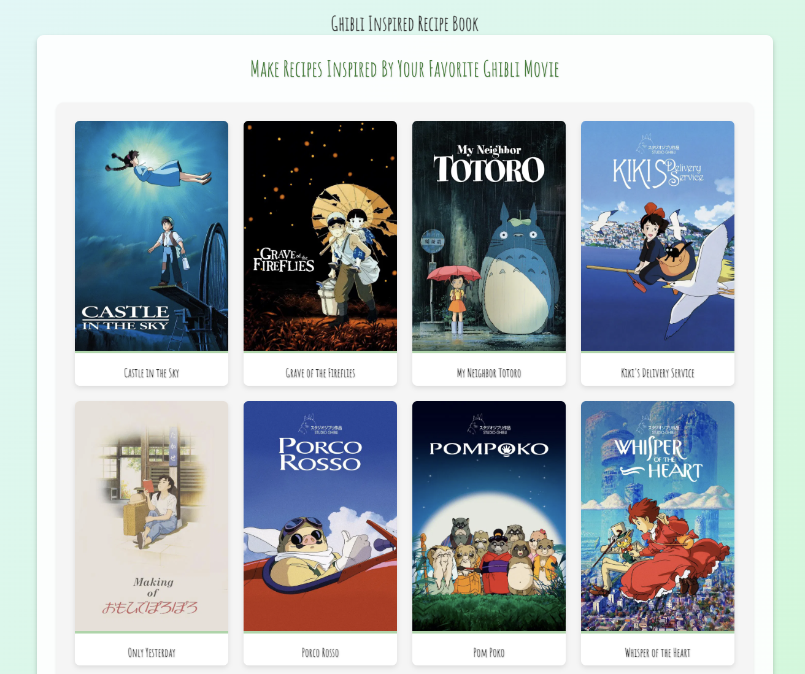
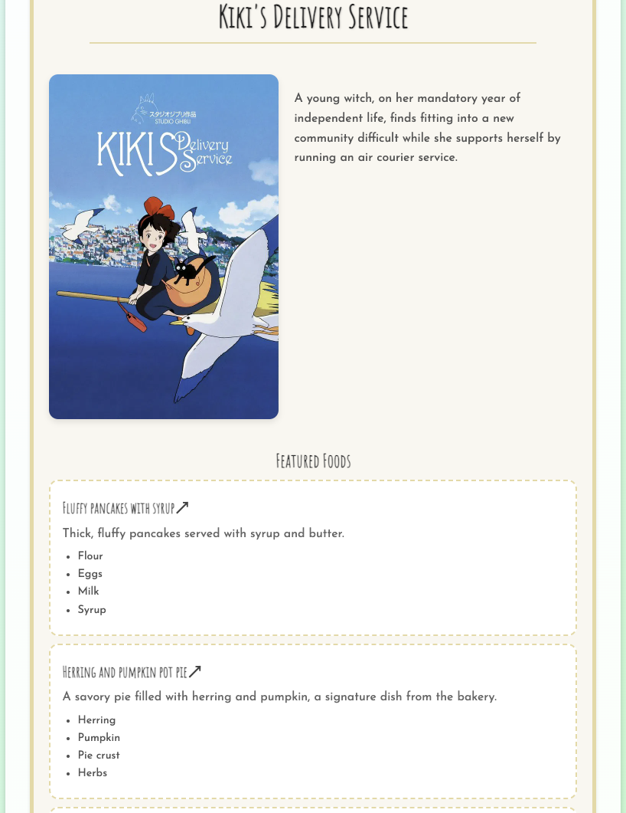

# 🍳 Ghibli Inspired Recipe Book

A magical collection of recipes inspired by the beautiful food scenes from Studio Ghibli films. From Howl's bacon and eggs to Spirited Away's feast, bring the enchanting flavors of Studio Ghibli into your own kitchen.

<p align="center">
  
</p>

<p align="center">
  
</p>

## ✨ Features

- **Movie-Based Recipe Collections**: Browse recipes organized by your favorite Ghibli films
- **Beautiful Design**: Clean, whimsical interface that captures the Studio Ghibli aesthetic
- **Responsive Layout**: Optimized for desktop, tablet, and mobile devices
- **Easy Navigation**: Simple, intuitive browsing experience

## 🎬 Featured Movies

Discover recipes inspired by iconic Ghibli films including:

- My Neighbor Totoro
- Spirited Away
- Howl's Moving Castle
- Kiki's Delivery Service
- Castle in the Sky
- Princess Mononoke
- And many more!

## 🛠️ Tech Stack

- **Framework**: [Next.js](https://nextjs.org/), [React](https://reactjs.org/)
- **Styling**: [Styled Components](https://styled-components.com/)
- **Language**: JavaScript
- **API**: [Studio Ghibli API](https://ghibliapi.vercel.app/)

## 🚀 Getting Started

### Prerequisites

- Node.js 18+
- npm or yarn

### Installation

1. Clone the repository

```bash
git clone https://github.com/yourusername/ghibli-recipe-book.git
cd ghibli-recipe-book
```

2. Install dependencies

```bash
npm install
# or
yarn install
```

3. Run the development server

```bash
npm run dev
# or
yarn dev
```

4. Open [http://localhost:3000](http://localhost:3000) in your browser

5. Enjoy exploring Ghibli-inspired recipes!``

## 📝 License

This project is licensed under the MIT License - see the [LICENSE](LICENSE) file for details.

## ⚖️ Disclaimer

This is a fan-made project created out of love for Studio Ghibli films. All movie titles, characters, and imagery are the property of Studio Ghibli and their respective copyright holders. This project is not affiliated with or endorsed by Studio Ghibli.

## 🙏 Acknowledgments

- **Studio Ghibli** for creating the magical worlds that inspire us
- **Hayao Miyazaki** and all the talented artists behind these incredible films
- The [Studio Ghibli API](https://ghibliapi.vercel.app/) for providing access to movie data.

## 📞 Contact

Have a recipe suggestion or found a bug? Feel free to:

- Open an issue on GitHub
- Submit a pull request

---

_"A heart's a heavy burden."_ - Howl's Moving Castle

Made with 💚 by fans, for fans
